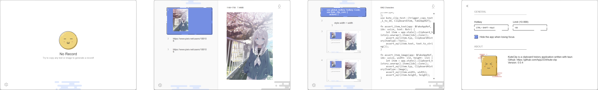

# KuteClip

KuteClip is a clipboard history written with [tauri](https://github.com/tauri-apps/tauri), supporting Windows and Mac.

Features
----

- [MBE](https://dribbble.com/Madebyelvis) style!  
- Run on Windows and Mac
- Texts and images are supported

ScreenShot (Windows)
----

FAQ
----

### Why is linux not supported?

There is no plan to support X11 because many Linux distributions have been running in Wayland in recent years. However, the application cannot listen to clipboard changes in the backend due to the official Wayland protocol.

License
----

GPL v3